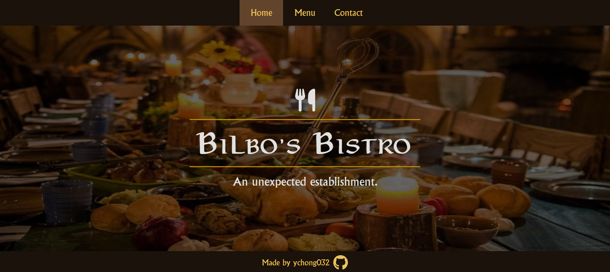

# Bilbo's Buffet

A mock restaurant page created with HTML, CSS, and JavaScript. Currently a work in progress.

## Credits

-   Hobbit feast image from [Stuff](https://www.stuff.co.nz/travel/destinations/nz/waikato/106274822/hobbiton-eat-at-the-worlds-greatest-hobbit-feast)
-   Lembas bread image from [Celebration Generation](https://celebrationgeneration.com/gluten-free-lembas-recipe/)
-   Various food images from [Feast of Starlight](http://www.feastofstarlight.com/)
-   Roast chicken image by [Anshu A](https://unsplash.com/@anshu18) on [Unsplash](https://unsplash.com/photos/BhnZwPW_tIc)
-   Roast potatoes image by [Markus Winkler](https://unsplash.com/@markuswinkler) on [Unsplash](https://unsplash.com/photos/9DEggBoY8CY)
-   Cider braised rabbit image from [Rhubarb & Lavender](https://www.rhubarbandlavender.com/lord-of-the-rings-a-hobbits-feast/)
-   Strawberries and cream tart image by [Diliara Garifullina](https://unsplash.com/@dilja96) on [Unsplash](https://unsplash.com/photos/THMuaASAP5Y)
-   Old tankard ale from [A Potable Pastime](https://potablepastime.wordpress.com/2016/05/10/old-tankard-ale/)
