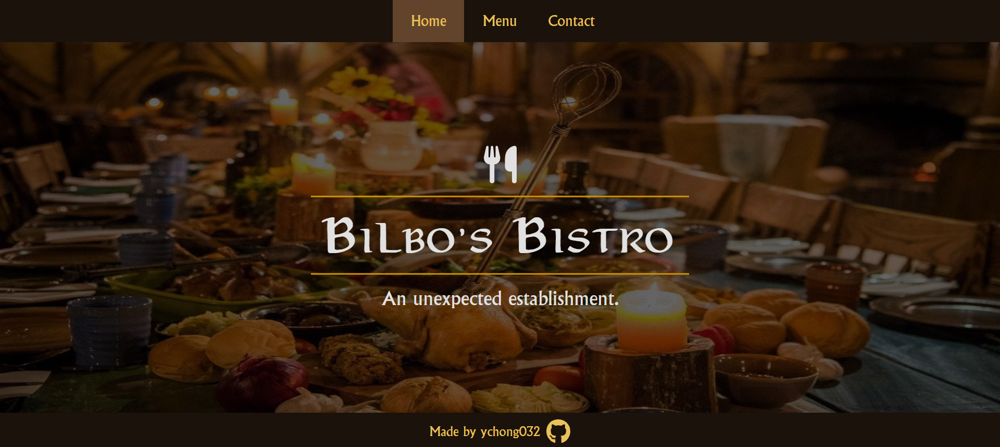
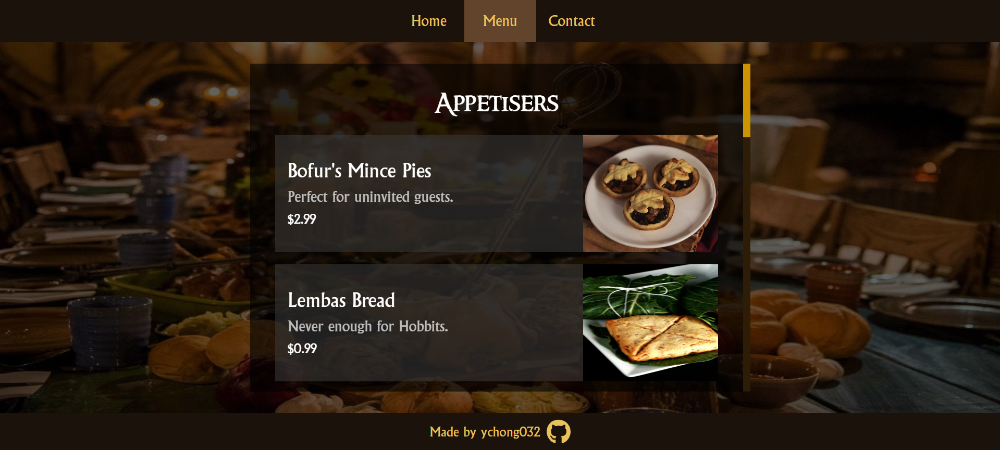
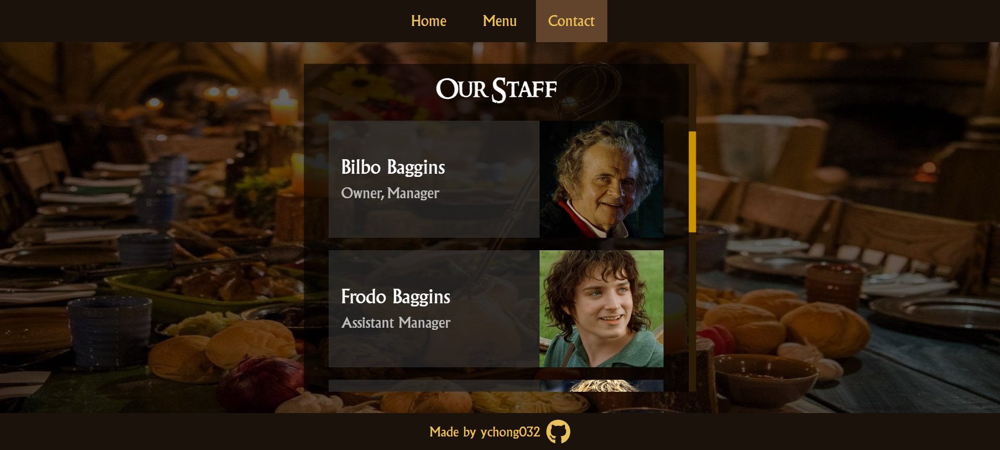

# Bilbo's Bistro

A mock restaurant page created with HTML, CSS, and JavaScript.

Check it out on GitHub Pages [here](https://ychong032.github.io/restaurant-page).

## Credits
### Images
-   Hobbit feast from [Stuff](https://www.stuff.co.nz/travel/destinations/nz/waikato/106274822/hobbiton-eat-at-the-worlds-greatest-hobbit-feast)
-   Lembas bread from [Celebration Generation](https://celebrationgeneration.com/gluten-free-lembas-recipe/)
-   Roast chicken by [Anshu A](https://unsplash.com/@anshu18) on [Unsplash](https://unsplash.com/photos/BhnZwPW_tIc)
-   Roast potatoes by [Markus Winkler](https://unsplash.com/@markuswinkler) on [Unsplash](https://unsplash.com/photos/9DEggBoY8CY)
-   Cider braised rabbit from [Rhubarb & Lavender](https://www.rhubarbandlavender.com/lord-of-the-rings-a-hobbits-feast/)
-   Strawberries and cream tart by [Diliara Garifullina](https://unsplash.com/@dilja96) on [Unsplash](https://unsplash.com/photos/THMuaASAP5Y)
-   Old tankard ale from [A Potable Pastime](https://potablepastime.wordpress.com/2016/05/10/old-tankard-ale/)
-   Several more from [Feast of Starlight](http://www.feastofstarlight.com/)

### Fonts
- Aniron by Pete Klassen on [DaFont](https://www.dafont.com/aniron.font)
- Ringbearer by Pete Klassen on [DaFont](https://www.dafont.com/ringbearer.font)
- Albertus MT by Berthold Wolpe on [Freefontsfamily.com](https://freefontsfamily.com/albertus-mt-font-free/)
